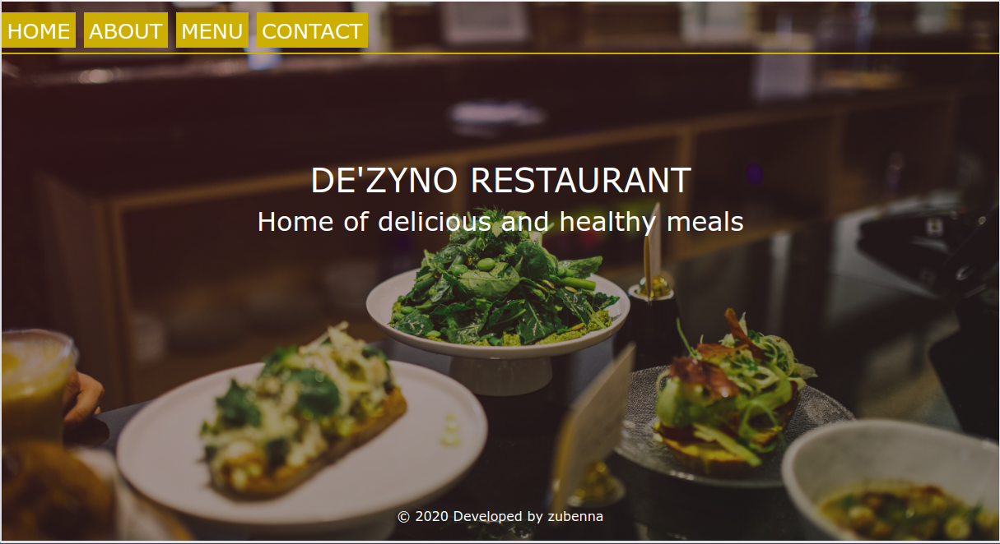
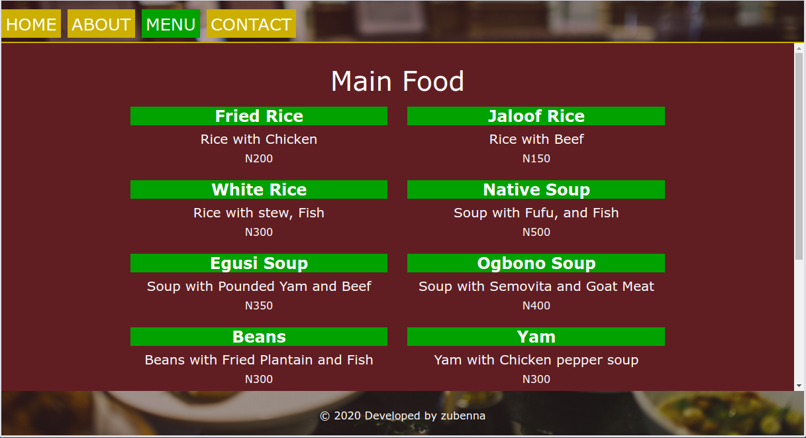
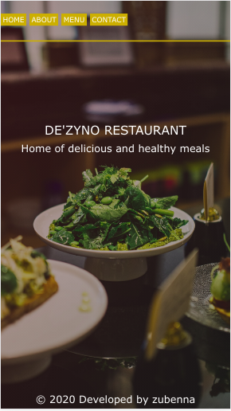
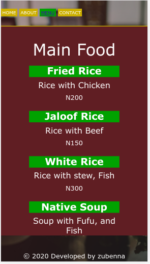

## Restaurant Page

This is a one page application designed to display basic information about a restaurant. It is made up of the initial page load which has tabs for home, menu, contact, and about modules. JavaScript codes are written for each module. This scripts creates and loads the html elements and page when clicked. When clicked, each tab displays the right information about the page accordingly. Webpack compiles the JavaScript code written in ES6 to a version that can be read by most browsers.

## Preview

## Home Page, Desktop view


## Menu Page, Desktop view


## Home Page, Mobile view


## Menu Page, Mobile view


## Features 

- Single Page Application.
- Pages are arranged in modules. 
- Pages are loaded when equivalent tab is clicked.
- Webpack compiles ES6 JavaScript code.

## Project SetUp

Get a local copy of the file. Clone with HTTPS using the command below.

```
git clone https://github.com/Zubenna/restaurant-page.git
```
## Access project folders 
```
cd restaurant-page, then, cd dist.
```
- Click on index.html to display the application on the browser.
- Text all application features.

## Live Version
- [Launch App](https://zubenna.github.io/restaurant-page/)

## Built With
- JavaScript
- Webpack
- HTML
- CSS
- Bootstrap 4


## Author

👤 **Nnamdi Emelu**
- Github: [@zubenna](https://github.com/zubenna)
- Twitter: [@zubenna](https://twitter.com/zubenna)
- Linkedin: [nnamdi-emelu](https://www.linkedin.com/in/nnamdi-emelu/)

##  Contributing

Contributions, issues, and feature requests are welcome!

Feel free to check the [issues page](https://github.com/Zubenna/restaurant-page/issues)

## Show your support

Give a star if you like this project!

## Acknowledgments
- Project originally taken from The Odin Project
- Project inspired by Microverse Program